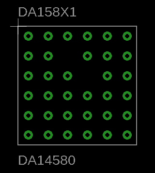

# THE DA14580 - LOW POWER BLUETOOTH SMART SoC

The DA14580 integrated circuit has a fully integrated radio transceiver and baseband processor for Bluetooth® Smart. It can be used as a standalone application processor or as a data pump in hosted systems. The DA14580 supports a flexible memory architecture for storing Bluetooth profiles and custom application code, which can be updated over the air (OTA). The qualified Bluetooth Smart protocol stack is stored in a dedicated ROM. All software runs on the ARM® Cortex®-M0 processor via a simple scheduler.
You can read more about it on their website: [http://www.farnell.com/datasheets/2258984.pdf](http://www.farnell.com/datasheets/2258984.pdf)

<!--  -->
